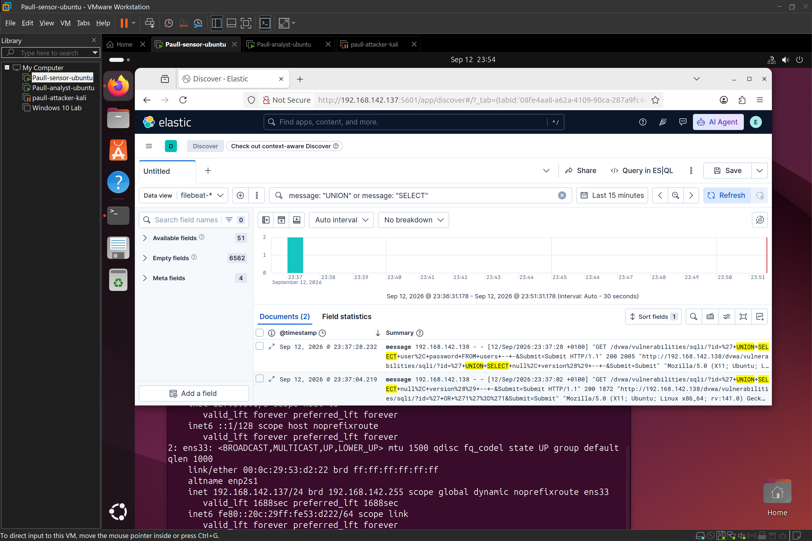
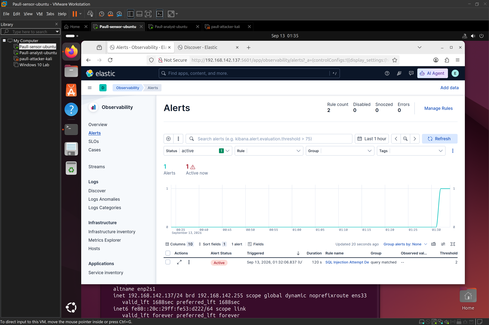
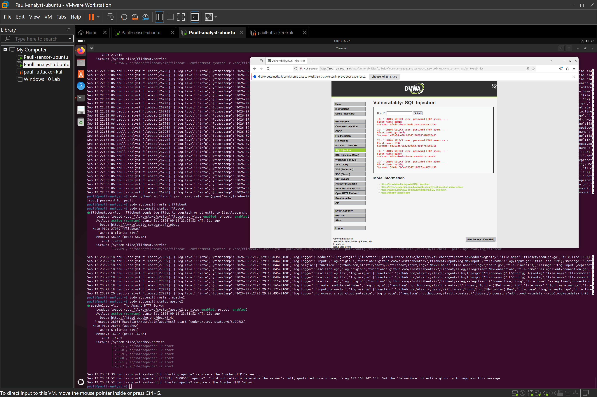
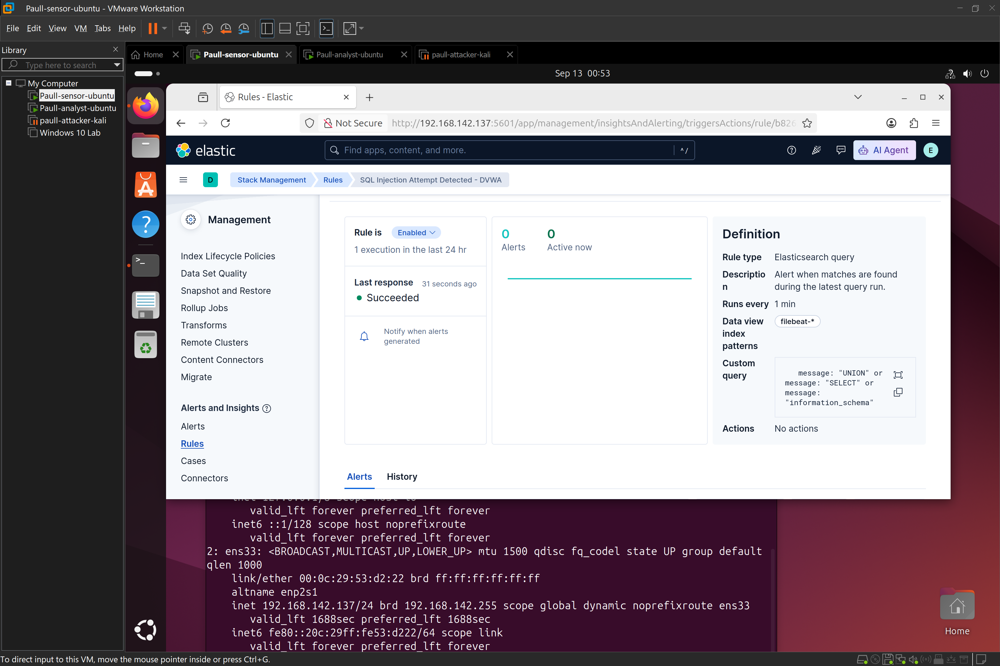

# SQL-Injection-Detection-with-ELK-Stack

# Objective

The objective of this lab is to deploy a ```deliberately vulnerable web application (DVWA),``` execute a SQL injection attack chain against it, and build a SIEM detection and alert rule to catch the activity — demonstrating web-layer attack detection as a contrast to the network/auth-layer detection built for the SSH brute-force lab.

# Environment
 | Role    | Host name     |   Tool stack
 | :---:      | :---:      | :---:
 | Attacker  | Paull-attacker-kali | Kali linux, broswer.
 | Victim | paull-analyst | Ubuntu server, Apache, MariaDB, PHP, DVWA,Filebeat.
 | Siem | paull - sensor | Ubuntu server, ElasticSearch, kibana 
  * Note - All three VMs run in VMware Workstation on an isolated internal network. Private IP ranges shown in screenshots are lab-only and in-accessible by external entity.
    
# Setup summary

  **1.** LAMP stack installed on the victim host: ``` sudo apt install apache2 mariadb-server php php-mysqli php-gd libapache2-mod-php -y ```
   
  **2.** DVWA database created: ``` CREATE DATABASE dvwa;CREATE USER 'dvwa'@'localhost' IDENTIFIED BY 'dvwapass123';GRANT ALL PRIVILEGES ON dvwa.* TO 'dvwa'@'localhost';FLUSH PRIVILEGES; ```

 

    
   **3.** DVWA cloned and configured:
   ```
   cd /var/www/html sudo git clone https://github.com/digininja/DVWA.git dvwa
   sudo chown -R www-data:www-data /var/www/html/dvwa
   sudo chmod -R 755 /var/www/html/dvwa
```
    
   ***3(a) Database credentials set in config/config.inc.php to match the created database. allow_url_include enabled in php.ini to satisfy DVWA's setup requirements.***
  
  **4.** Database initialized via ```setup.php``` > "Create / Reset Database", then logged in with default credentials ```(admin / password).```

  **5.** Security level set to Low (DVWA Security page) — required to make the SQL injection vulnerability reliably exploitable without DVWA's built-in input sanitization interfering.

**6.** Filebeat extended to ship Apache logs, adding a second ```filestream``` input alongside the existing SSH/syslog input:
   
```yaml
filebeat.inputs:
 type: filestream
  id: system-logs
  enabled: true
  paths:
  - /var/log/auth.log
  - /var/log/syslog```
type: filestream
  id: apache-logs
  enabled: true
  paths:
    - /var/log/apache2/access.log
    - /var/log/apache2/error.log.
```
  
# Attack Simulation:

**Target:** DVWA's SQL Injection module ```(/dvwa/vulnerabilities/sqli/)``` 
**Method:** manual payload injection via the **"User ID"** input field, escalating from authentication bypass to full data exfiltration.

**payload chain used.**

| Step | Payload | Purpose |
|---|---|---|
| 1 | `' OR '1'='1` | Authentication/logic bypass — forces the query to return all rows |
| 2 | `' UNION SELECT null, version() -- -` | Database fingerprinting — confirms UNION-based injection works and reveals DB version |
| 3 | `' UNION SELECT null, table_name FROM information_schema.tables -- -` | Schema enumeration — lists table names in the database |
| 4 | `' UNION SELECT user, password FROM users -- -` | Data exfiltration — dumps usernames and password hashes from the `users` table |
 
All four payloads executed successfully against the Low security setting, confirming the application is vulnerable to classic UNION-based SQL injection with no input sanitization at this security level.
 
## Detection — Kibana Discover
 
Unlike SSH (encrypted, requiring host-log correlation), HTTP traffic to a plaintext web app logs the attack payload directly and visibly in Apache's access log — the raw injection syntax appears in the request line itself.
 
**Query used to isolate SQLi activity:**
```
message: "UNION" or message: "SELECT" or message: "information_schema"
```
 
This returned matching Apache access log entries showing the injection payloads as submitted, confirming the attack is fully visible at the web-server log level without needing to inspect encrypted traffic or correlate across log sources.
 

 
## Alert Rule
 
| Setting | Value |
|---|---|
| Rule type | Elasticsearch query |
| Data view | `filebeat-*` |
| Query | `message: "UNION" or message: "SELECT" or message: "information_schema"` |
| Threshold | `count() IS ABOVE 2` |
| Time window | `5 minutes` |
| Check frequency | `Every 1 minute` |
| Name | SQL Injection Attempt Detected - DVWA |

**Design note on threshold/window choice:** SQLi testing tends to be slower and more deliberate than automated brute-force traffic (a human trying payloads one at a time), so a lower count threshold (2, vs. 5 for Hydra) and a longer window (5 minutes, vs. 1 minute for Hydra) better matches this attack pattern's realistic tempo.
 
The rule was validated by re-submitting a SQLi payload and confirming the test query returned a non-zero match count within the configured window, then confirming an alert instance appeared under **Alerts and Insights → Alerts**.
 

 
## IOC Table
 
| IOC Type | Value | Context |
|---|---|---|
| Source IP | 192.168.142.138 | SQLi origin |
| Target | paull-analyst / DVWA `sqli` module | Vulnerable web application endpoint |
| Vulnerable parameter | `id` (User ID field) | Injection point |
| Payload pattern | `UNION SELECT`, `information_schema`, `' OR '1'='1` | Signatures indicating SQL injection attempt |
| Impact | Full `users` table dumped (usernames + password hashes) | Confirmed successful data exfiltration |
 
## Triage Note
 
```
Alert: SQL Injection Attempt Detected
Host: paull-analyst (DVWA web application)
Source IP: 192.168.142.138
Timestamp: sept 13, 2026 01:32:06
Matched Requests: 3+
Verdict: True Positive
Severity: High
Next Steps:
  - Take the vulnerable application offline, restrict access immediately foor critical/urgent fix)
  - Patch the application: use parameterized queries/prepared statements instead of raw string concatenation
  - Rotate all credentials exposed in the users table dump
  - Review web server access logs for any further exploitation attempts from the same source
  - Consider WAF (Web Application Firewall) rules to block common SQLi syntax patterns as a compensating control
```
 
## Timeline
 
> At sept 12, 2026, @ 23:37:28 , a series of HTTP requests containing SQL injection payloads were submitted against the DVWA application's SQL Injection module on paull-analyst, originating from 192.168.142.138. The payloads progressed from a basic logic-bypass injection to UNION-based queries targeting the database schema and ultimately the `users` table, resulting in exposure of stored usernames and password hashes. The configured Kibana alert rule detected the payload pattern and generated an alert instance within the configured 5-minute detection window.
 
## Key Takeaway
 
This lab demonstrates a useful contrast with the SSH brute-force lab: where SSH's encryption meant the attack had to be inferred from connection *patterns* and correlated with host authentication logs, an unencrypted web application logs the literal attack syntax in plaintext. This makes web-layer attacks like SQL injection often *easier* to detect via log analysis (the payload itself is the indicator), but the *impact* of a successful attack — direct database exfiltration — can be more immediately severe than a single compromised SSH account. It also reinforces why input validation and parameterized queries matter at the application layer: detection is valuable, but this vulnerability class should be prevented at the source, not just monitored.


 ## PHOTO DUMP
 
 
## Tools Used
- Kali Linux
- DVWA (Damn Vulnerable Web Application)
- Apache, MariaDB, PHP
- Elastic Stack (Elasticsearch, Kibana)
- Filebeat


